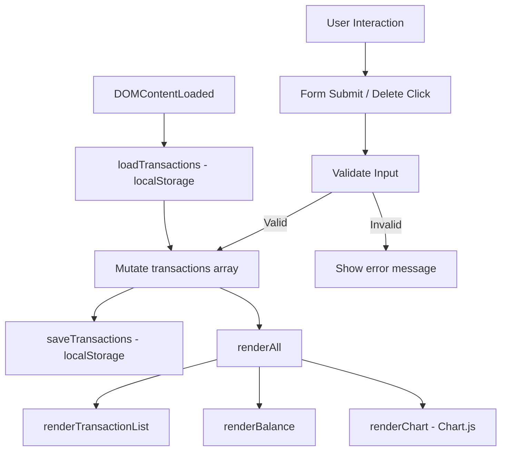

# Design Document: Expense & Budget Visualizer

## Overview

The Expense & Budget Visualizer is a zero-dependency, client-side single-page application (SPA) built with vanilla HTML, CSS, and JavaScript. It lets users record expenses, view a running balance, browse a scrollable transaction history, and see a live pie chart of spending by category. All data is persisted in `localStorage` — no server, no build step, no framework.

The architecture follows a simple unidirectional data flow:

```
User Action → Mutate In-Memory Array → Persist to localStorage → Re-render UI
```

A single `renderAll()` function is the sole entry point for UI updates, keeping state management trivial and predictable.

## Architecture



### Key Design Decisions

- **No framework**: Keeps the app launchable by double-clicking `index.html`. No npm, no bundler.
- **Single re-render entry point (`renderAll`)**: Avoids partial update bugs. Every mutation calls `renderAll` with the current array.
- **In-memory array as source of truth**: `localStorage` is the persistence layer; the in-memory `transactions` array drives all rendering.
- **Chart.js via CDN**: Loaded with a `<script>` tag — no build step required.

## Components and Interfaces

### File Structure

```
/
├── index.html
├── css/
│   └── styles.css
└── js/
    └── app.js
```

### HTML Components

| Element | ID / Selector | Purpose |
|---|---|---|
| Balance display | `#balance` | Shows sum of all transaction amounts |
| Input form | `#transaction-form` | Collects name, amount, category |
| Name input | `#name` | Text field for item name |
| Amount input | `#amount` | Number field for expense amount |
| Category select | `#category` | Dropdown: Food, Transport, Fun |
| Error container | `#error-msg` | Displays validation error messages |
| Transaction list | `#transaction-list` | `<ul>` of all transactions |
| Chart canvas | `#spending-chart` | Chart.js pie chart target |

### JavaScript Module (`js/app.js`)

All logic lives in a single file, organized into four logical groups:

#### Storage Layer

```
loadTransactions() → Transaction[]
  Reads "transactions" key from localStorage, JSON-parses it.
  Returns [] if key is absent or JSON is invalid.

saveTransactions(transactions: Transaction[]) → void
  JSON-serializes the array and writes it to localStorage under "transactions".
```

#### Core Logic Layer

```
addTransaction(name: string, amount: number, category: Category) → void
  Creates a Transaction object with a unique id (Date.now()).
  Appends it to the in-memory array.
  Calls saveTransactions.

deleteTransaction(id: number) → void
  Filters the transaction with the given id out of the in-memory array.
  Calls saveTransactions.

getTotalBalance(transactions: Transaction[]) → number
  Returns the sum of all transaction amounts.
  Returns 0 for an empty array.

getCategoryTotals(transactions: Transaction[]) → { [category: string]: number }
  Returns an object mapping each category to its summed amount.
  Only includes categories with at least one transaction.
```

#### Validation Layer

```
validateForm(name: string, amount: string) → string[]
  Returns an array of human-readable error messages.
  Checks: name is non-empty (after trim), amount is present, amount parses to a positive number.
  Returns [] if all inputs are valid.
```

#### Rendering Layer

```
renderTransactionList(transactions: Transaction[]) → void
  Clears and re-renders #transaction-list.
  Each <li> shows: name, amount, category, delete button.
  Delete button click → deleteTransaction(id) → renderAll().

renderBalance(transactions: Transaction[]) → void
  Updates #balance text with getTotalBalance result.

renderChart(transactions: Transaction[]) → void
  Calls getCategoryTotals.
  If no transactions: shows placeholder / destroys existing chart instance.
  Otherwise: creates or updates a Chart.js Pie chart on #spending-chart.

renderAll(transactions: Transaction[]) → void
  Calls renderTransactionList, renderBalance, renderChart in sequence.
  This is the ONLY function that touches the DOM for data display.
```

#### Initialization

```
DOMContentLoaded handler:
  1. loadTransactions() → populate in-memory array
  2. renderAll(transactions)
  3. Attach submit handler to #transaction-form
```

## Data Models

### Transaction

```js
{
  id: number,        // Date.now() at creation time — unique identifier
  name: string,      // Item name, non-empty, user-provided
  amount: number,    // Positive number, represents expense value
  category: string   // One of: "Food" | "Transport" | "Fun"
}
```

### Category Enum

```js
const CATEGORIES = ["Food", "Transport", "Fun"];
```

### localStorage Schema

| Key | Value |
|---|---|
| `"transactions"` | JSON-serialized `Transaction[]` |

Example stored value:
```json
[
  { "id": 1700000000000, "name": "Lunch", "amount": 12.50, "category": "Food" },
  { "id": 1700000001000, "name": "Bus pass", "amount": 30.00, "category": "Transport" }
]
```

### getCategoryTotals Return Shape

```js
// Example output for the above transactions
{
  "Food": 12.50,
  "Transport": 30.00
}
```

### Chart.js Integration

Chart.js is loaded from CDN:
```html
<script src="https://cdn.jsdelivr.net/npm/chart.js"></script>
```

The `renderChart` function maintains a module-level reference to the current `Chart` instance. Before creating a new chart, it destroys the previous instance to avoid the "Canvas is already in use" error:

```js
let chartInstance = null;

function renderChart(transactions) {
  const totals = getCategoryTotals(transactions);
  const labels = Object.keys(totals);
  const data = Object.values(totals);

  if (chartInstance) {
    chartInstance.destroy();
    chartInstance = null;
  }

  if (labels.length === 0) {
    // Show placeholder text — no chart rendered
    return;
  }

  chartInstance = new Chart(document.getElementById('spending-chart'), {
    type: 'pie',
    data: {
      labels,
      datasets: [{ data, backgroundColor: ['#FF6384', '#36A2EB', '#FFCE56'] }]
    }
  });
}
```


## Correctness Properties

*A property is a characteristic or behavior that should hold true across all valid executions of a system — essentially, a formal statement about what the system should do. Properties serve as the bridge between human-readable specifications and machine-verifiable correctness guarantees.*

### Property 1: getTotalBalance correctness

*For any* array of transactions (including the empty array), `getTotalBalance` SHALL return a value equal to the arithmetic sum of all `amount` fields. For an empty array it SHALL return exactly `0`.

**Validates: Requirements 4.1, 4.4**

---

### Property 2: getCategoryTotals correctness

*For any* array of transactions, `getCategoryTotals` SHALL return an object whose keys are exactly the distinct categories present in the array, and whose values equal the sum of amounts for each respective category. For an empty array it SHALL return an empty object.

**Validates: Requirements 5.1, 5.4**

---

### Property 3: validateForm rejects empty or whitespace-only names

*For any* string composed entirely of whitespace characters (including the empty string), `validateForm` SHALL return a non-empty error array indicating the name field is invalid.

**Validates: Requirements 1.5**

---

### Property 4: validateForm rejects non-positive amounts

*For any* amount value that is zero, negative, or non-numeric, `validateForm` SHALL return a non-empty error array indicating the amount field is invalid.

**Validates: Requirements 1.6**

---

### Property 5: addTransaction grows the array

*For any* valid transaction (non-empty name, positive amount, valid category), calling `addTransaction` SHALL result in the in-memory transactions array containing a new entry with the supplied name, amount, and category, and the array length SHALL increase by exactly one.

**Validates: Requirements 1.2**

---

### Property 6: deleteTransaction removes the target

*For any* transactions array and any transaction `id` present in that array, calling `deleteTransaction(id)` SHALL result in the array containing no entry with that `id`, and the array length SHALL decrease by exactly one.

**Validates: Requirements 3.2**

---

### Property 7: Storage round-trip preserves data

*For any* array of transactions, calling `saveTransactions` followed by `loadTransactions` SHALL return an array that is deeply equal to the original (same ids, names, amounts, and categories in the same order).

**Validates: Requirements 1.3, 3.3, 6.1**

---

### Property 8: Rendered list item completeness

*For any* non-empty array of transactions, every `<li>` element produced by `renderTransactionList` SHALL contain the transaction's name, amount, and category as visible text, and SHALL contain a delete control element.

**Validates: Requirements 2.1, 3.1**

---

## Error Handling

| Scenario | Handling |
|---|---|
| `localStorage` is unavailable (private browsing, quota exceeded) | `saveTransactions` wraps the write in a try/catch; logs a console warning. The in-memory array remains the source of truth for the current session. |
| `localStorage` contains malformed JSON | `loadTransactions` wraps `JSON.parse` in a try/catch; returns `[]` on failure. |
| Form submitted with empty name | `validateForm` returns an error message; form submission is aborted. |
| Form submitted with non-positive or non-numeric amount | `validateForm` returns an error message; form submission is aborted. |
| `deleteTransaction` called with an id not in the array | `filter` produces no change; no error thrown. |
| Chart.js not loaded (CDN failure) | `renderChart` checks for `window.Chart` before instantiating; logs a console error if absent. |


```
/
├── index.html
├── css/styles.css
├── js/app.js
└── tests/
    ├── unit.test.js       (example-based unit tests)
    └── property.test.js   (fast-check property tests)
```
